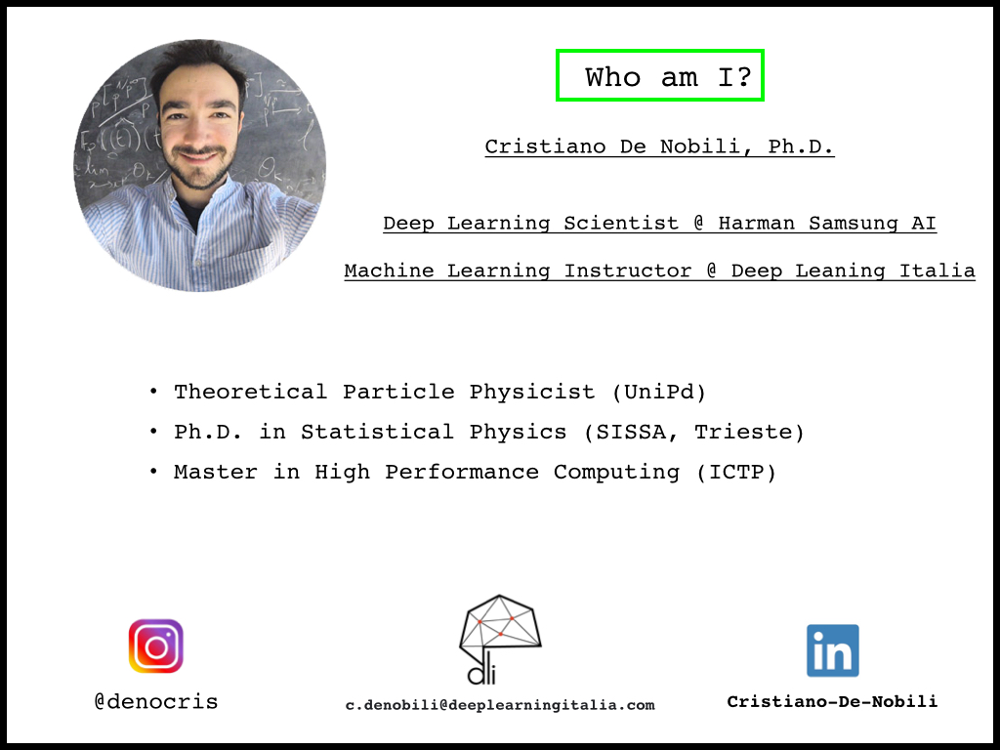

 <h1>Deep Learning for Computer Vision: an introduction</h1> 

These lectures were given by me at a Master in Data Science. They fisrt part is a general introduction to TensorFlow (notebook 01), while the second part covers a general understanding of neural networks and CNN (notebooks 02,03). Lastly, an advanced application (denoising autoencoders) is shown.

## Presentation

## References

A lot of useful references about Machine Learning and Deep Learning can be found in refs.md file. Have a look at it and enjoy!
